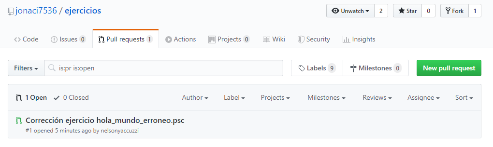
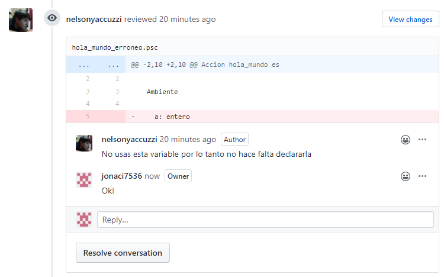

# Pull Request

## Que son los Pull Request?

Los Pull Request es un poderoso mecanismo que nos ofrece GitHub haciendo uso del sistema de control de versionado Git. Mediante estos cualquier usuario de github puede proponer cambios a tu codigo, permitiendo al dueño del codigo revisar con mucho nivel de detalle los cambios presentados y decidiendo si añadirlos a su codigo base.

De esta manera, los profes pueden proponer correcciones a sus ejercicios y comentar sobre los mismos. Luego ustedes pueden añadir estas correcciones a  sus ejercicios originales.

Por ahora, los pull request los harán los profesores y uds lo recibirán, comentarán y aceptarán. Por ahora ustedes no necesitaran realizar pull requests, por lo tanto no lo vamos a tratar.

## Tabla de Contenido

En esta sección veremos lo siguiente

- [Compartir ejercicio](#compartir-ejercicio)
- [Revisar Pull Requests](#revisar-pull-requests)
- [Comentar un Pull Request](#comentar-un-pull-request)
- [Aceptar Pull Request](#aceptar-pull-request)

## Compartir ejercicio

Supongamos que tienen el siguiente ejercicio el cual quieren que sea revisado por sus profesores.

Para esto lo único que hay que hacer es compartir el link del ejercicio al profesor

Ingresando a la URL compartida el profesor o cualquier persona puede ver tu ejercicio.

[https://github.com/jonaci7536/ejercicios/blob/master/hola_mundo_erroneo.psc](https://github.com/jonaci7536/ejercicios/blob/master/hola_mundo_erroneo.psc)

## Revisar Pull Requests

Una vez que su ejercicio fue compartido deben esperar por el pull request del profesor donde se encontrarán las correcciones pertinentes.

Podrán revisar si tienen Pull Request pendiente en la pestaña *Pull Request* dentro de su repositorio

Dentro podrán ver todos los pull request que estan pendientes de resolución, generalmente van a ser uno por cada ejercicio. También se puede ver quien realizó el pull request y cuando.

Cuando ingresamos al pull request lo primero que vemos es la conversación y el listado de eventos sobre el mismo

También se van a poder ver comentarios sobre partes especificas de su código para tener mejor referencias

Si nos dirigimos a la pestaña *Files Changed* dentro de nuestro pull request podremos ver especficiamente que cambio en nuestro codigo luego de la corrección.

## Comentar un Pull Request

Ustedes pueden comentar sobre el pull request que realizo el profesor tanto a nivel de los comentarios en su codigo especifico como a nivel general.

Por cada uno de los comentarios especficios pueden continuar el hilo de conversacion y comentar sus dudas y dificultades. Pueden cerrar la conversacion, haciendo click en *Resolve conversation*

Tambien pueden comentar a nivel general en la parte inferior de la pestaña *Conversation*

## Aceptar Pull Request

Una vez que mediante los comentarios del profesor y los suyos todas las dudas hayan sido despejadas, los cambios propuestos pueden ser aplicados a su código original. 

> La aplicación de un pull request sobre tu código se la denomina *Merge*

Para esto, en la parte inferior de la conversación de nuestro Pull Request vamos a ver lo siguiente

Aqui GitHub nos esta indicando que no hay conflictos para poder aplicar nuestros cambios y que podemos proceder a realizarlo.

Para hacerlo hacemos click en *Merge Pull Request*

Agregamos un título y un comentario, ya que el pull request se aplica como un commit nuevo en el repositorio, y luego confirmamos el merge haciendo click en *Confirm Merge*

El Merge fue aplicado satisfactoriamente y los cambios propuestos por el profe ahora son parte de tu codigo.

Notese tambien que ya no hay Pull Request pendientes a resolver

## Listo

Muy bien! ya sabes como revisar las correcciones que te hacen los profesores, creemos que de esta forma es mucho mas interactiva y les va a permitir tener mas visibilidad sobre las correcciones de sus ejercicios.

Esto es todo lo que necesitamos saber de GitHub por ahora, si tienen preguntas adicionales que quisieran que respondamos, por favor haganosla llegar y las reponderemos en [esta sección ](preguntas.md)